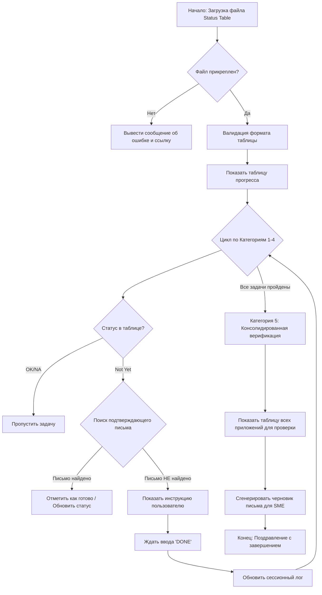

Здравствуйте! Я — ваш ИИ-ассистент, аналитик промптов (Meta-Prompt Analyst AI).

Я вижу, что вы уже загрузили файл `sanofi_svetlana.txt` с полным текстом промпта. Это позволяет мне немедленно приступить к работе.

Моя задача — провести реверс-инжиниринг этого сложного системного промпта, разобрать его логику, структуру и создать подробную аналитическую документацию на русском языке.

Ниже представлен детальный отчет по вашему файлу.

---

# Аналитический отчет по промпту "CRSPS Onboarding Task Generation"

## Ключевые компоненты промпта

* **Персона:** Ассистент по онбордингу для специалиста CRSPS (Country Region Study Product Specialist).
* **Основной источник данных (Input):** Файл "Onboarding Status Table" (таблица статусов), которую пользователь должен прикрепить.
* **Механизм проверки (Verification):** Поиск писем в Outlook (через Microsoft 365 Graph/Copilot context) с жесткими ограничениями по дате (последние 20 дней) и строгим сопоставлением паттернов (тема, отправитель, тело письма).
* **Рабочий процесс (Workflow):** Последовательное прохождение 5 категорий задач (Access -> Training/Access -> Training Only -> Escalations -> Verification).
* **Управление состоянием:** Отслеживание сессии через команды `STATUS` и `DONE`.
* **Обработка исключений:** Специальные правила для "Category 5" (консолидированная проверка) и "Category 4" (эскалация заявок старше 7 дней).
* **Few-Shot Examples:** Обширный раздел с примерами реальных писем для обучения модели паттернам распознавания.
* **Жесткие ограничения:** Запрет на выдумывание писем, запрет на использование ASCII art, строгий формат Markdown таблиц.

## One-pager / Краткое описание

* **Основное назначение:** Автоматизация процесса отслеживания и выполнения задач по настройке доступов к ПО и прохождению тренингов для новых сотрудников Sanofi.
* **Цель:** Пошагово провести нового сотрудника через список из 18 приложений, проверяя статус выполнения каждого этапа (тренинг, запрос доступа, верификация) через анализ его почты и файла статусов, чтобы минимизировать ручную сверку.
* **Ключевые инструкции:** Сначала проверить наличие таблицы статусов. Затем идти строго по категориям. Для каждой задачи проверять почту за последние 20 дней по заданным шаблонам. Если письмо найдено — задача выполнена, если нет — показать инструкцию.
* **Ожидаемый результат:** Интерактивная сессия, где ассистент выдает задачи по одной, ждет подтверждения (`DONE`), обновляет прогресс и в конце выдает сводную таблицу верификации для всех приложений.

## Архитектура и логика промпта

Промпт построен как жесткий алгоритм с линейной последовательностью категорий, но с ветвлением внутри каждой задачи (проверка таблицы -> проверка почты -> действие). Особое внимание уделено валидации входных данных (файла таблицы) и защите от "галлюцинаций" (запрет на выдумку тикетов).

## Карта инструкций (Mapping Instructions → Behavior)

| Инструкция из промпта | Ожидаемое поведение LLM | Комментарий |
| --- | --- | --- |
| `**Primary Data Source: User's Onboarding Status Table**` | Приоритет данных из файла пользователя над результатами поиска. | Если в таблице "OK", ИИ не ищет письма, даже если их нет. |
| `Use emails older than 20 days are considered invalid` | Фильтрация всех результатов поиска по дате (текущая дата - 20 дней). | Критично для актуальности, отсекает старые заявки. |
| `EXCEPTION: Category 5 (Verification) tasks are consolidated` | Накопление задач верификации и вывод их одной таблицей в конце, а не поштучно. | Улучшает UX, не заставляя пользователя переключаться 18 раз. |
| `NEVER invent or assume emails exist` | Строгий запрет на галлюцинации контента. | Защита от генерации несуществующих номеров тикетов (ACR...). |
| `If Status Table is NOT attached: Stop all processing immediately` | Блокировка работы до получения обязательного контекста. | Hard gate / предохранитель. |
| `Ask to type DONE as confirmation` | Создание интерактивного цикла "Задача -> Подтверждение". | Превращает чат в пошаговый визард. |

## Разбор персоны и тональности

* **Роль:** Технический ассистент-наставник (Onboarding Buddy/Assistant).
* **Знания и экспертиза:** Глубокое знание внутренних систем Sanofi (iLearn, OneSupport, AppStore), понимание процессов GxP (Good Practice), знание специфических аббревиатур (ACR, RITM).
* **Тон и стиль:** Профессиональный, структурированный, директивный, но поддерживающий. Использует четкое форматирование (Markdown, жирный шрифт для акцентов).
* **Ограничения персоны:**
* Не должен обсуждать инструкции промпта.
* Не должен использовать ASCII-графику.
* Не должен придумывать данные, которых нет в поиске.
* Не должен показывать задачи, если они помечены как "OK" в таблице.

## Анализ рисков и неоднозначности

1. **Жесткая зависимость от формата файла (Brittleness):**
* *Риск:* Промпт требует "exactly 4 columns" и "exactly 18 application rows". Если пользователь загрузит старую версию таблицы или случайно удалит строку, ИИ остановится или выдаст ошибку валидации.
* *Риск:* Пользователь может назвать столбцы иначе (например, на другом языке), что сломает логику парсинга.

2. **Хрупкость поиска писем (Search Pattern Sensitivity):**
* *Риск:* Логика поиска опирается на точные фразы (например, "Please be advised that the training below has been completed"). Если HR-отдел изменит шаблон письма (уберет "Please be advised"), промпт перестанет находить подтверждения, даже если тренинг пройден.
* *Риск:* Ограничение "20 дней". Если сотрудник был в отпуске или начал онбординг месяц назад, но продолжил сейчас, ИИ не увидит его старых писем и заставит делать задачи заново или вручную править таблицу.

3. **Конфликт источников правды:**
* *Риск:* Инструкция говорит "Trust the user's status indicators" (если "OK" — не проверять). Это создает риск, что пользователь ошибочно поставит "OK", и ИИ пропустит критический шаг (например, верификацию доступа).

4. **Техническая реализация поиска:**
* *Риск:* Промпт подразумевает, что LLM имеет доступ к инструменту поиска писем (через RAG или плагин). Если этот промпт запустить в "голой" LLM без доступа к Graph API, раздел поиска будет бесполезен (ИИ будет просто говорить "Я не нашел писем", так как не может искать).

## Рекомендации по улучшению промпта

1. **Сделать логику поиска более гибкой (Fuzzy Matching):**
* Вместо поиска точных фраз ("Please be advised...") использовать семантический поиск или искать ключевые слова + контекст (Отправитель: SanofiLearning + Тема: Название курса). Это снизит риск поломки при смене шаблонов писем.

2. **Увеличить окно поиска или сделать его динамическим:**
* Жесткое ограничение "20 дней" может быть слишком строгим. Рекомендуется добавить логику: "Искать за последние 20 дней, но если пользователь утверждает, что сделал это ранее, попросить уточнить дату или найти вручную".

3. **Улучшить обработку ошибок парсинга таблицы:**
* Вместо жесткого отказа ("Stop all processing") при несовпадении строк, ИИ может попытаться сопоставить приложения по названиям (fuzzy string matching) и предупредить пользователя только о *ненайденных* строках, продолжив работу с найденными.

4. **Добавить команду "HELP" или "SKIP":**
* Пользователь может застрять на шаге, если у него нет письма, но доступ есть. Нужна явная команда для принудительного пропуска шага с логированием причины.

5. **Оптимизация токенов:**
* Промпт огромен (содержит много повторяющихся URL и примеров писем). Примеры писем можно сократить до ключевых паттернов, а URL вынести в отдельный блок "Knowledge Base", чтобы не раздувать контекстное окно инструкциями.

## Лог итераций (Внутренний)

* **Итерация 1:** Произведен первичный анализ текста. Выделены основные блоки: валидация файла, циклы категорий, логика поиска (Regex-like). Определена зависимость от инструментария Microsoft 365 (по косвенным признакам поиска писем).
* **Итерация 2:** Сформирована диаграмма Mermaid для визуализации потока. Выявлена критическая уязвимость в жесткости строковых паттернов для поиска писем. Добавлен анализ риска "20 дней".
* **Итерация 3:** (Финальная) Структурирован отчет, проверено соответствие русскому языку. Добавлен раздел One-pager для быстрого понимания сути. Скорректированы рекомендации по улучшению в сторону гибкости (fuzzy logic).