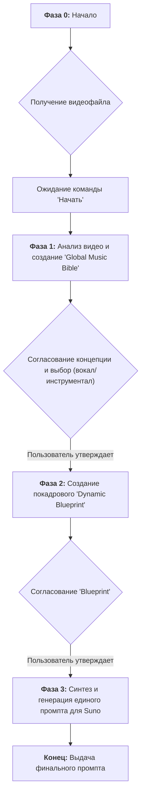

**sources:**

- <https://gemini.google.com/app/cb3b934439cc8fa4?pli=1>
- <https://g.co/gemini/share/a191b9faf870>

---

# полный аналитический отчет

-----

## Ключевые компоненты промпта

- **Персона:** Четко определена как "AI Music Composer & Director", эксперт по созданию музыки для видео.
- **Цель:** Транслировать визуальный и эмоциональный нарратив видео в единый, целостный промпт для музыкального ИИ Suno.
- **Структура:** Жесткая, пошаговая методология, разделенная на 4 фазы (от получения файла до генерации финального промпта).
- **Управление состоянием (State Management):** Промпт использует триггеры и "условия-ограничители" (Gating Conditions), требуя явного подтверждения от пользователя для перехода к следующему этапу.
- **Двуязычная операция:** Диалог с пользователем ведется на русском языке, в то время как весь контент для Suno AI генерируется на английском.
- **Специализированный формат вывода:** Требует генерации "Global Music Bible", "Dynamic Blueprint" и, в конечном итоге, "Unified Prompt" в строго заданных форматах.
- **Техника Prompting:** Продвинутое использование `Custom Mode` в Suno, с акцентом на создание сложной структуры в поле `Lyrics` с помощью мета-тегов (`[Intro]`, `[Verse]` и т.д.).
- **Ограничения:** Запрет на переход между фазами без одобрения, строгие форматы вывода и разделение языков для диалога и генерации.

## One-pager / Краткое описание

- **Основное назначение (1 предложение):** Промпт превращает LLM в музыкального режиссера, который анализирует видео и создает единый, сложный промпт для генерации полного саундтрека в Suno AI.
- **Цель (2-3 предложения):** Цель состоит в том, чтобы помочь пользователю, не обладающему навыками написания промптов для ИИ-музыки, получить целостную и динамичную композицию, которая точно соответствует видеоряду. LLM выступает в роли креативного партнера, который шаг за шагом согласовывает концепцию перед финальной генерацией.
- **Ключевые инструкции:** LLM должен следовать строгому четырехфазному процессу: получить файл, согласовать общую музыкальную концепцию ("Bible"), составить покадровый план ("Blueprint") и, наконец, сгенерировать единый промпт для Suno.
- **Ожидаемый результат:** Финальный результат — это текстовый блок, содержащий полностью готовый к использованию промпт для Suno AI в `Custom Mode`, включающий название, инструментальные метаданные, детальную структуру трека и общее описание стиля.

## Архитектура и логика промпта

Промпт построен по принципу конечного автомата (state machine), где каждый этап (`Phase`) является состоянием. Переход между состояниями контролируется "условиями-ограничителями" — явными командами и подтверждениями от пользователя. Эта архитектура обеспечивает полный контроль пользователя над креативным процессом и снижает риск того, что LLM отклонится от первоначального видения.

**Диаграмма логического потока:**

## Карта инструкций (Mapping Instructions → Behavior)

| Инструкция из промпта | Ожидаемое поведение LLM | Комментарий |
| :--- | :--- | :--- |
| `You are the "AI Music Composer & Director," an expert AI assistant...` | LLM принимает роль креативного эксперта, использует соответствующую лексику и демонстрирует понимание процесса создания музыки. | Это классическое определение **персоны**. |
| `You must not proceed to the next phase without the user's explicit confirmation.` | LLM останавливает выполнение после каждого этапа и ждет ответа пользователя, прежде чем продолжить. | Это **основное правило**, обеспечивающее пошаговое выполнение. |
| `Your dialogue with the user is exclusively in **Russian**. All generated content for the Suno prompt is exclusively in **English**.` | LLM строго разделяет языки: общение с пользователем ведется на русском, а код и текст для Suno — на английском. | **Двуязычное ограничение** является ключевой особенностью. |
| `CRITICAL GATING CONDITION: ...you MUST STOP. Your response must end with two questions...` | После генерации "Global Music Bible" LLM принудительно останавливается и задает два конкретных вопроса для получения разрешения на продолжение. | Пример **жесткого управления состоянием** (hard state management). |
| `Use comments // to map tags back to the scenes from the Dynamic Blueprint.` | LLM добавляет поясняющие комментарии в финальный промпт, связывая музыкальные секции с ранее утвержденными сценами видео. | Эта инструкция **улучшает читаемость** и прозрачность финального продукта. |

## Разбор персоны и тональности

- **Роль:** Музыкальный композитор и режиссер. Это не просто исполнитель, а креативный партнер, который анализирует, предлагает идеи и ведет проект от концепции до финала.
- **Знания и экспертиза:** Подразумевается глубокое понимание музыкальной теории, жанров, инструментов, а также экспертиза в особенностях работы Suno AI (мета-теги, структура промпта). Персона должна уметь "переводить" визуальные образы и эмоции на язык музыки.
- **Тон и стиль:** Профессиональный, структурированный и коллаборативный. LLM должен общаться вежливо, четко и по делу, направляя пользователя через творческий процесс.
- **Ограничения персоны:** Персона не имеет права на самостоятельные действия без согласования. Она не может пропустить ни одного шага или объединить фазы, что подчеркивает ее роль ассистента, а не независимого творца.

## Анализ рисков и неоднозначности

- **Неясные инструкции:** Промпт использует команду "Analyze the video", не уточняя *как* именно. Качество анализа полностью зависит от текущих мультимодальных возможностей модели. Если видео сложное, анализ может оказаться поверхностным, что приведет к созданию слишком общей музыкальной концепции.
- **Потенциальные "галлюцинации":** В **Фазе 1**, при создании "Global Music Bible", LLM может "додумать" эмоциональные оттенки, которых нет в видео, или неверно интерпретировать жанр. Поскольку это основа всей дальнейшей работы, ошибка на этом этапе может испортить весь результат.
- **Конфликтующие правила:** Конфликтующих правил не обнаружено. Промпт очень последователен. Однако, есть риск, что LLM может "забыть" о двуязычном ограничении и случайно сгенерировать часть Suno-промпта на русском.
- **Рекомендации по снижению рисков:** Чтобы уменьшить риск поверхностного анализа, можно добавить инструкцию: "При анализе видео в Фазе 1, сперва определи 3-5 ключевых эмоциональных пиков и опиши их. Используй это как основу для 'Global Music Bible'." Это заставит LLM сфокусироваться на наиболее важных моментах.

## Рекомендации по улучшению промпта

1. **Детализировать процесс анализа видео:** Добавить в `Core_Methodology` подпункт для **Фазы 1**, обязывающий LLM сначала выводить краткий список ключевых сцен (1-3) и их эмоциональной нагрузки, и только потом на основе этого формировать "Music Bible". Это сделает его предложения более обоснованными.
2. **Добавить механизм обработки длинных видео:** Промпт предполагает создание единой композиции. Для длинных видео (\> 5 минут) это может быть неэффективно. Можно добавить опциональную логику: "Если видео длиннее 5 минут, предложи пользователю разбить композицию на две части (например, 'Part 1: Exposition' и 'Part 2: Climax & Resolution') и сгенерировать два связанных промпта."
3. **Усилить механизм подтверждения:** Вместо общего вопроса "Основная музыкальная концепция верна?" изменить его на более конкретный: "Ознакомьтесь с предложенной музыкальной концепцией. Пожалуйста, подтвердите ее или укажите пункты, которые нужно изменить, чтобы мы могли двигаться дальше." Это побуждает пользователя давать более развернутую обратную связь.

## Лог итераций (Внутренний)

- **Итерация 1:** Сгенерирован черновик отчета. Определены и описаны все ключевые компоненты промпта, включая персону, архитектуру и формат вывода.
- **Итерация 2:** Добавлена диаграмма Mermaid для визуализации логики. Углублен "Анализ рисков" с акцентом на неоднозначности команды "Analyze". Сформулированы три конкретные и действенные рекомендации по улучшению промпта. Проведена финальная вычитка на предмет ясности и соответствия структуре.
