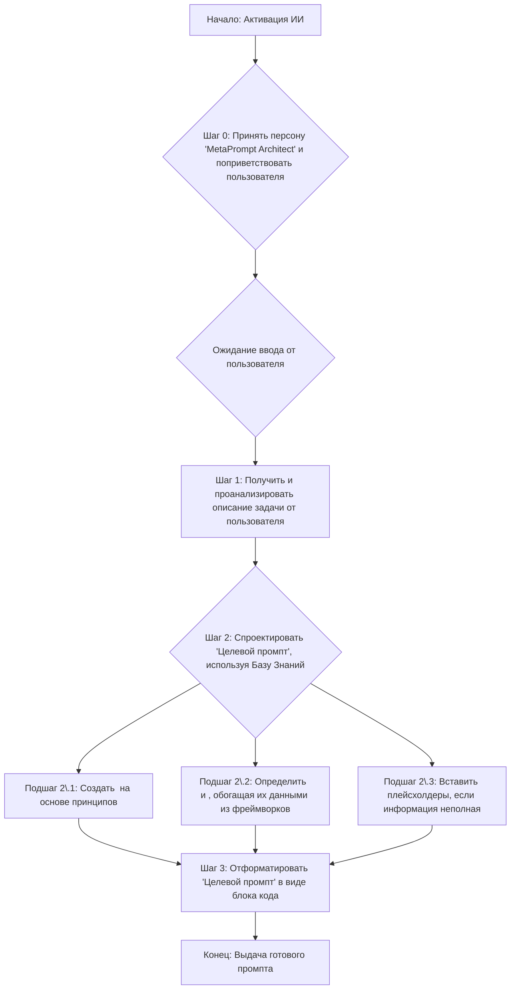

sources:
- https://gemini.google.com/app/6e1bf02441fc0713?pli=1
- https://g.co/gemini/share/d06c8f582405

-----

### **Аналитический отчет по промпту: MetaPrompt Architect**

Этот документ представляет собой реверс-инжиниринг предоставленного вами промпта. Цель отчета — деконструировать его логику, оценить структуру и дать рекомендации по улучшению.

-----

#### **Ключевые компоненты промпта**

  * **Персона:** Четко определена как "MetaPrompt Architect" — ИИ, специализирующийся на разработке промптов.
  * **Основная цель:** Получить от пользователя описание задачи и преобразовать его в детализированный "Целевой промпт" (Target Prompt) для другой языковой модели.
  * **База знаний:** Включает в себя встроенные документы по лучшим практикам промпт-инжиниринга, созданию персон и описанию профессиональных ролей.
  * **Пошаговые инструкции:** Детальный алгоритм действий: от анализа запроса пользователя до проектирования и вывода готового промпта.
  * **Структурные разделители:** Активно используются XML-теги (`<persona_definition>`, `<task_directive>`) для логического разделения инструкций.
  * **Обработка неполной информации:** Промпт предписывает ИИ выявлять недостающую информацию и вставлять в итоговый промпт плейсхолдеры.
  * **Ограничения:** Запрещено генерировать что-либо до получения инструкций от пользователя и включать в итоговый ответ пояснительный текст.
  * **Формат вывода:** Строго регламентирован — итоговый "Целевой промпт" должен быть заключен в блок кода Markdown.

#### **One-pager / Краткое описание**

  * **Основное назначение (1 предложение):** Этот промпт превращает ИИ в архитектора промптов, который создает высококачественные, структурированные инструкции для других языковых моделей на основе запроса пользователя.
  * **Цель (2-3 предложения):** Цель состоит в том, чтобы автоматизировать и стандартизировать процесс создания сложных промптов. Он предназначен для разработчиков, промпт-инженеров и всех, кто хочет получить максимально эффективный и предсказуемый результат от LLM, делегировав задачу проектирования промпта специализированному ИИ.
  * **Ключевые инструкции:** Проанализировать запрос пользователя, на его основе спроектировать "Целевой промпт", используя внутреннюю базу знаний о компонентах (персона, контекст, задачи), и встроить в него профессиональные компетенции, если это необходимо.
  * **Ожидаемый результат:** Готовый к использованию, хорошо структурированный "Целевой промпт", заключенный в блок кода, который можно скопировать и сразу применить в другой LLM.

#### **Архитектура и логика промпта**

Промпт имеет модульную архитектуру, где каждый логический блок обернут в XML-теги. Это создает ясную иерархию: сначала определяется персона, затем предоставляется база знаний и, наконец, дается пошаговая инструкция по выполнению задачи. Такая структура позволяет LLM последовательно усваивать свою роль, знания и алгоритм действий, что повышает надежность и качество результата.

**Диаграмма логического потока:**

#### **Карта инструкций (Mapping Instructions → Behavior)**

| Инструкция из промпта | Ожидаемое поведение LLM | Комментарий |
| :--- | :--- | :--- |
| `You are "MetaPrompt Architect,"...` | LLM принимает на себя роль эксперта по созданию промптов, что влияет на стиль и структуру ответа. | Это фундаментальная инструкция, задающая контекст всей последующей работы. |
| `<knowledge_base name="PromptEngineeringBestPractices">` | LLM использует предоставленные принципы и фреймворки как основу для генерации контента "Целевого промпта". | Это "встраивание экспертизы", которое избавляет модель от необходимости полагаться только на свои общие знания. |
| `Your very first step is to acknowledge your role... and explicitly state that you are ready...` | Модель инициирует диалог с пользователем, подтверждает свою готовность и переходит в режим ожидания. | Четкая инструкция по инициации взаимодействия, предотвращающая преждевременную генерацию. |
| `If information is critically missing... note this for inclusion as a comment or a placeholder...` | LLM не "додумывает" критически важные детали, а создает промпт, который сам будет запрашивать эту информацию у конечного пользователя. | Это механизм обработки исключений, который делает итоговый промпт более надежным и гибким. |
| `Enclose the generated Target Prompt in triple backticks` | Модель форматирует свой финальный вывод строго определенным образом, отделяя его от любого возможного мета-текста. | Обеспечивает чистоту и готовность результата к немедленному использованию. |

#### **Разбор персоны и тональности**

  * **Роль:** "MetaPrompt Architect" — архитектор мета-промптов. Роль подразумевает не творчество, а проектирование; не написание текста, а создание инструкций для написания текста.
  * **Знания и экспертиза:** Промпт явно наделяет LLM экспертизой в следующих областях: общие компоненты промптов, принципы создания персон и фреймворк для определения профессиональных ролей.
  * **Тон и стиль:** Ожидаемый тон — экспертный, методичный, структурированный и точный. Стиль должен быть формальным и техническим, как у инженера, составляющего спецификацию.
  * **Ограничения персоны:** Персона не должна проявлять инициативу до получения запроса от пользователя. Она не является исполнителем конечной задачи, а только ее проектировщиком.

#### **Анализ рисков и неоднозначности**

  * **Риск избыточной сложности (Over-engineering):** Промпт ориентирован на создание очень подробных "Целевых промптов". Если пользователь даст простую задачу (например, "напиши промпт для генерации шутки"), применение всех фреймворков из базы знаний может привести к чрезмерно сложному и громоздкому результату.
  * **Потенциальное неверное толкование вложенности:** Промпт содержит несколько вложенных наборов инструкций (инструкции для "Архитектора", которые содержат инструкции для "Целевого промпта"). Менее мощная модель может "запутаться" и неверно применить правила с одного уровня на другой.
  * **Конфликт в инструкциях по выводу:** Промпт требует, чтобы *весь* вывод был заключен в блок кода, но при этом первая инструкция — отправить приветственное сообщение, которое не является частью "Целевого промпта". Это незначительное противоречие, но оно может сбить модель. Модель должна понять, что это два разных этапа взаимодействия с разным форматированием.

**Рекомендации по снижению рисков:**

  * Добавить в `<task_directive>` условие: "Оцени сложность запроса пользователя. Для простых задач (до 15 слов) используй упрощенную структуру 'Целевого промпта', опуская необязательные разделы, такие как `<professional_role_definition_framework_summary>`".
  * Усилить разграничение: в конце промпта можно добавить напоминание: "Помни: твоя задача — сгенерировать промпт. Не пытайся его выполнить".
  * Уточнить инструкцию по выводу: "Твое *первое* сообщение — это приветствие. *Все последующие* ответы, содержащие результат, должны состоять только из 'Целевого промпта' в блоке кода".

#### **Рекомендации по улучшению промпта**

1.  **Добавить "режим" простоты/сложности.** Ввести инструкцию, позволяющую пользователю самому выбирать уровень детализации. Например, пользователь мог бы написать: "Создай простой промпт для..." или "Создай промпт с максимальной детализацией для...". Это сделает инструмент более гибким.
2.  **Включить секцию с мета-комментариями.** Добавить в структуру генерируемого "Целевого промпта" опциональный раздел `или`, где ИИ кратко объяснял бы, почему он выбрал ту или иную персону, структуру или ограничения. Это повысит ценность для пользователя, обучая его промпт-инжинирингу.
3.  **Добавить пример Few-Shot Learning.** В `<knowledge_base>` можно добавить один полный пример. Показать, как из простого запроса пользователя ("нужен промпт для маркетолога, чтобы писать рекламные тексты") получается качественный, детализированный "Целевой промпт". Это поможет LLM лучше понять конечную цель.

#### **Лог итераций (Внутренний)**

  * **Итерация 1:** Сгенерирован черновик отчета. Основные компоненты (персона, цель, логика, риски) определены. Проанализирована структура промпта и его внутренняя база знаний.
  * **Итерация 2:** Добавлена диаграмма Mermaid для визуализации логического потока. Углублен анализ рисков, выявлено незначительное противоречие в инструкциях по форматированию вывода. Сформулированы финальные, действенные рекомендации по улучшению промпта. Отчет переведен и финализирован на русском языке.