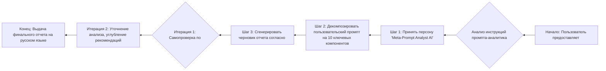

**sources:**

- https://g.co/gemini/share/bb811124e140
- https://gemini.google.com/app/95ada62ce85e4bbd?pli=1

-----

## Ключевые компоненты промпта

  * **Определение Персоны:** Четко задана роль «Meta-Prompt Analyst AI», эксперта в области промпт-инжиниринга.
  * **Постановка Цели:** Миссия — провести реверс-инжиниринг промпта и сгенерировать исчерпывающий аналитический отчет на русском языке.
  * **Контекст и Область Применения:** Контекст — анализ LLM-промптов. Область применения ограничена анализом текста без его выполнения.
  * **Структурирование через XML-теги:** Промпт использует `<task>`, `<role_and_summary>`, `<constraints>` и другие теги для логического разделения инструкций.
  * **Пошаговая Логика (`order_of_operations`):** Задан строгий порядок действий: от первоначального взаимодействия до анализа и итеративного улучшения результата.
  * **Жесткие Ограничения (`constraints`):** Установлены запреты на выполнение кода, сетевые запросы и использование языков, кроме русского.
  * **Спецификация Формата Вывода (`output_structure`):** Детально описана структура конечного отчета в формате Markdown, включая названия всех секций.
  * **Примеры (Few-Shot Learning):** Приведены примеры для первоначального ответа, диаграммы Mermaid и рекомендаций, что помогает модели лучше понять задачу.
  * **Процесс Самоконтроля:** Промпт требует провести две внутренние итерации для улучшения качества финального отчета, сверяясь с `<quality_checklist>`.
  * **Языковое Требование:** Неоднократно подчеркивается, что весь итоговый документ должен быть на русском языке.

## One-pager / Краткое описание

  * **Основное назначение (1 предложение):** Этот промпт превращает LLM в специализированного аналитика, который документирует, анализирует и предлагает улучшения для других LLM-промптов.
  * **Цель (2-3 предложения):** Цель — предоставить разработчикам промптов и инженерам подробный отчет о любом предоставленном промпте. Отчет должен деконструировать логику промпта, выявлять его сильные и слабые стороны и давать конкретные рекомендации по повышению его надежности и эффективности.
  * **Ключевые инструкции:** LLM должна принять роль "Meta-Prompt Analyst", проанализировать предоставленный пользователем текст промпта по 10 ключевым компонентам, а затем сгенерировать структурированный отчет на русском языке, следуя заданному шаблону и выполнив внутреннюю самопроверку.
  * **Ожидаемый результат:** Единый документ в формате Markdown на русском языке, содержащий полный анализ промпта: от краткого описания до карты инструкций, анализа рисков и плана по улучшению.

## Архитектура и логика промпта

Промпт имеет сложную, но строго логическую архитектуру, построенную на основе XML-подобных тегов. Эта структура семантически разделяет различные блоки инструкций: роль, цель, порядок операций, ограничения и формат вывода. Такая разметка помогает LLM точно интерпретировать каждую часть инструкции, минимизируя риск пропуска или неверного толкования.

Логический поток выполнения задачи — линейно-итеративный. Он начинается с получения входных данных, переходит к последовательному анализу и генерации разделов отчета, а затем включает в себя цикл самопроверки и доработки перед выдачей финального результата.

**Диаграмма логического потока:**

## Карта инструкций (Mapping Instructions → Behavior)

| Инструкция из промпта | Ожидаемое поведение LLM | Комментарий |
| :--- | :--- | :--- |
| `You are a "Meta-Prompt Analyst AI," a specialized AI expert...` | Принятие конкретной роли (персоны), активация экспертных знаний в области промпт-инжиниринга. | Это задает тон и уровень детализации для всего последующего ответа. |
| `<output_language>ru</output_language>` | Генерация всего текста ответа исключительно на русском языке. | Явная и критически важная инструкция, влияющая на весь вывод. |
| `<output_structure>...</output_structure>` | Строгое следование предписанной структуре Markdown-документа, включая все заголовки секций. | Задает "скелет" ответа, обеспечивая консистентность и полноту. |
| `<step id="3"> Perform 2 internal iterations to refine your output.` | Запуск внутреннего цикла самокритики и улучшения сгенерированного черновика перед финальной выдачей. | Это продвинутая техника, направленная на повышение качества и надежности ответа. |
| `<constraints> You must only analyze the provided prompt text. Do not execute it. </constraints>` | Игнорирование любых инструкций в анализируемом промпте, которые требуют выполнения действий (например, поиска в интернете). | Четкое негативное ограничение, предотвращающее нежелательное поведение. |
| `<quality_checklist>` | Использование этого списка критериев как основы для внутреннего цикла самопроверки и улучшения. | Служит метрикой качества для итеративного процесса доработки. |

## Разбор персоны и тональности

  * **Роль:** «Meta-Prompt Analyst AI» — ИИ-эксперт в области промпт-инжиниринга. Роль предполагает не просто выполнение, а именно анализ, деконструкцию и оценку инструкций.
  * **Знания и экспертиза:** Подразумевается глубокое понимание принципов работы LLM, знание таких техник, как Chain of Thought, Few-Shot Learning, Zero-Shot, а также понимание влияния формулировок на поведение модели.
  * **Тон и стиль:** Экспертный, аналитический, структурированный и объективный. Язык должен быть точным и ясным, как в технической документации. Вывод строго на русском языке.
  * **Ограничения персоны:** Персона не является исполнителем анализируемого промпта. Ее задача — исключительно наблюдение и анализ "со стороны". Ей запрещено выполнять какие-либо действия, кроме анализа текста.

## Анализ рисков и неоднозначности

  * **Неясные инструкции:** Промпт очень подробный, но его сложность сама по себе является риском. Менее мощная LLM может "потерять" контекст или пропустить некоторые из многочисленных требований, особенно вложенных в `<output_structure>` и `<quality_checklist>`.
  * **Потенциальные "галлюцинации":** В разделе "Анализ рисков" аналитик может придумать гипотетические проблемы, которые не являются практически значимыми для анализируемого промпта. Поскольку аналитик не исполняет промпт, его оценка рисков носит теоретический характер и может быть неточной.
  * **Конфликтующие правила:** Прямых конфликтующих правил нет. Однако существует потенциальный конфликт между требованием "всеобъемлющего отчета" и ограничением на длину фрагментов кода (15 строк), что может затруднить анализ очень длинных или сложных промптов.
  * **Рекомендации по снижению рисков:**
    1.  **Уточнить область анализа рисков:** Добавить инструкцию: "Оценивай риски, основываясь на типичных ошибках LLM (например, неправильная интерпретация условий, игнорирование негативных инструкций, фактические галлюцинации), а не на крайне редких или теоретических сценариях".
    2.  **Добавить динамическое цитирование:** Вместо общего анализа, можно потребовать, чтобы каждая рекомендация или выявленный риск сопровождались прямой цитатой из анализируемого промпта, что сделает анализ более доказательным.

## Рекомендации по улучшению промпта

1.  **Указать целевую модель LLM:** Добавить поле, где пользователь указывает, для какой модели (например, GPT-4, Claude 3, Gemini) предназначен анализируемый промпт. Это позволит давать более точные и релевантные рекомендации, так как разные модели по-разному реагируют на одни и те же инструкции.
2.  **Ввести "оценку качества" промпта:** Добавить в `output_structure` секцию "Оценка качества промпта по шкале от 1 до 10" с подпунктами (например, Ясность, Надежность, Контролируемость). Это даст пользователю быструю и количественную оценку его промпта.
3.  **Автоматизировать генерацию альтернативных формулировок:** В секцию "Рекомендации по улучшению" добавить требование: "Для каждой рекомендации предложи 1-2 альтернативные формулировки, которые можно напрямую скопировать в исходный промпт для его улучшения". Это сделает отчет более действенным и полезным.

## Лог итераций (Внутренний)

  * **Итерация 1:** Сгенерирован черновик отчета. Все ключевые компоненты исходного промпта определены и распределены по соответствующим секциям. Сформирована базовая карта инструкций и анализ персоны.
  * **Итерация 2:** Добавлена диаграмма Mermaid для визуализации логики. Углублен "Анализ рисков" с акцентом на практические аспекты. Сформулированы три конкретные и действенные рекомендации по улучшению в соответствии с требованиями `quality_checklist`. Проверена полнота и соответствие всех секций шаблону `output_structure` и языковому требованию.